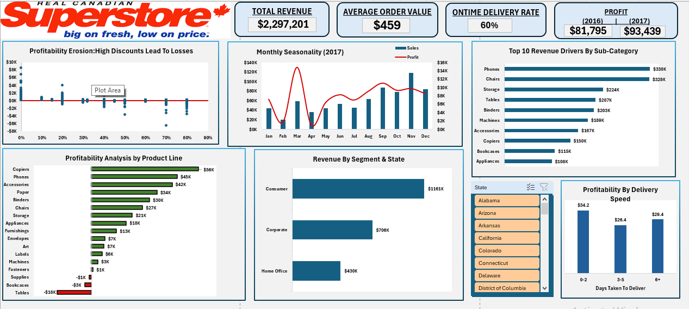

# 📊 Superstore Financial Analysis (Excel Project)

## 📌 Project Overview
This project is an end-to-end financial analysis of the Superstore dataset using advanced Excel tools. The goal was to analyze sales, profit, and operational performance and build an interactive dashboard for decision-making.

---

## 🎯 Objectives
- Analyze overall financial performance (Sales, Profit, Revenue trends)
- Identify loss-making segments and products
- Evaluate the impact of discount on profit
- Analyze shipping efficiency and delays
- Build an interactive dashboard for business insights

---

## 🛠️ Tools & Skills Used
- Microsoft Excel
- Power Query (ETL)
- Pivot Tables & Pivot Charts
- DAX (Data Analysis Expressions)
- Data Cleaning & Transformation
- Exploratory Data Analysis (EDA)
- Dashboard Design

---

## 📂 Dataset
- Superstore dataset (CSV format)
- Contains sales, customer, shipping, and product data

---

## 📊 Key Analysis Performed

### 1. Financial Performance
- Total Sales, Total Profit, Profit Margin
- Category and Sub-category performance

### 2. Discount vs Profit Analysis
- Identified that higher discounts reduce profitability

### 3. Shipping & Delivery Efficiency
- Created calculated column:
  `Delivery Days = Ship Date - Order Date`
- Analyzed delays and delivery performance

### 4. Customer & Regional Analysis
- Sales and profit by region
- Customer segment insights

---

## 📈 Dashboard Features
- Interactive filters (State)
- KPI Cards (Sales, Profit(2016 vs 2017),Profit Margin,Ontime Delivery Rate)
- Trend Analysis (Monthly)
- Visual insights for decision making

---

## 💡 Key Insights
- High discounts negatively impact profit
- Some categories generate high sales but low profit
- Delivery delays impact customer satisfaction
- Consumer segment is high revenue driver

---

## 🚀 Business Recommendations
- Optimize discount strategy
- Focus on high-profit products
- Improve shipping efficiency
- Target consumer segment for growth

---

## 📸 Dashboard Preview

---

## 📁 Files Included
- `data/` → Raw dataset (CSV)
- `dashboard/` → Excel dashboard (download to view)
- `report/` → Detailed Word report
- `image/` → Dashboard Screenshot

---

## 📬 Author
Faiza

---
> ⚠️ Note: Due to file size, GitHub cannot preview the Excel dashboard. Please download the file to view the full interactive dashboard.
⭐ If you like this project, feel free to star the repo!
